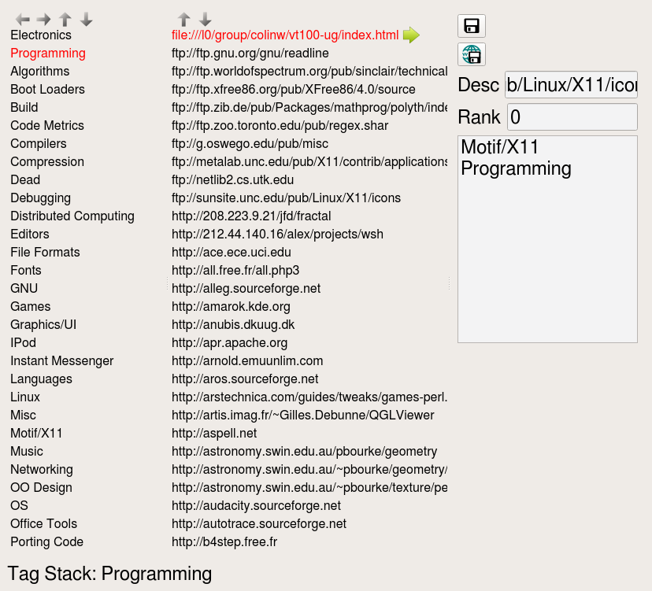

# CTagMarks #
Organise bookmarks by tags instead of folders

## ToDo ##
 + Integrate into Web.
 + Generate href for each tag to run CGI script to generate next page.
 + How add and store Multiple tags
 + Need easy way to:
 +   add multiple tags to bookmark
 +   add new bookmarks
 +   generate bookmarks web page

# CQTagMarks #
Qt Interface to tagged bookmarks.

## ToDo ##
 + easier interface to view tags and bookmarks.
 + Search and tag

## Features ##
 + hypertext like links in custom widget with floating image button on current item

# CTagMarksGen #
Generate tags from existing bookmarks HTML file (tags by directory stack)
